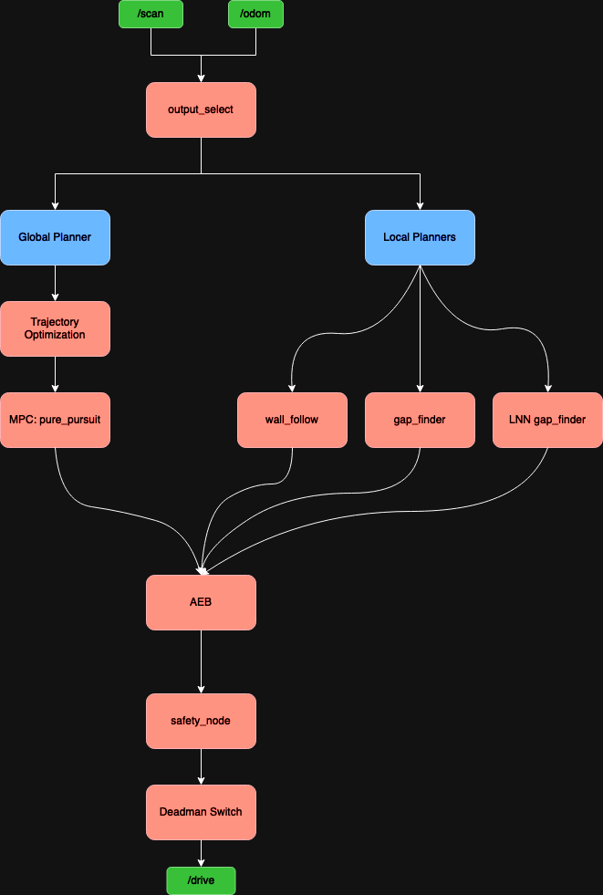

# F1Tenth IEEE IV 2024

This repository contains the code that was ran on the car for the F1Tenth IEEE IV 2024 race held in Jeju, Korea. The code here can be directly deployed onto the car.

# Quick Start

## Building the workspace
Clone the repo
```sh
git clone https://github.com/NTU-Autonomous-Racing-Team/race_stack_IV24.git
```
Build the workspace
```sh
cd race_stack_IV24/f1tenth_ws
colcon build
```

## Teleop

Connect the controller to the car then run
```sh
ros2 launch f1tenth_stack bringup_launch.py # Default launch file given by F1Tenth
```

To launch the car with safety nodes running
```sh
ros2 launch bringup bringup_safety_NO1.yaml
```

To launch the car with keyboard and joy teleop enabled
```sh
ros2 launch bringup bringup_key_teleop.yaml
ros2 run teleop_twist_keyboard teleop_twist_keyboard 
```
>NOTE: The commands above should be ran in separate terminals.

## Local Planners

In this race stack there are 2 local planners, `gap_finder` and `wall_follow`. For the competition `gap_finder` was the only planner that was used due to the much needed obstacle avoidance.

>NOTE: For all the commands make sure either one of the bringup launch files are running in a separate terminal and that the **controller is connected**

### Gap Finder
```sh
ros2 run gap_finder gap_finder_base.py
```

### Wall Follow
```sh
ros2 run wall_follow wall_follow.py
```

After running the desired planner, hold the deadman's switch to let the planner control the car. 
- For a **DS4 controller** hold **R1** 
- For a **Logitech F170 joypad** hold **LB**

## Global Planners 

1. Generate a map using slam_toolbox, run
    ```sh
    launch_slam_toolbox # Should put the actual ROS command here
    ```
    Then use teleop to drive the car around the area you want to map. 
    >NOTE: The slower the car moves, the better the generated map is. RVIZ can be used to visualise the mapping process. To do this launch rviz and add the map topic.

2. Clean the map using GIMP or any other photo editing software

3. Generate centerline

4. Generate trajectory

5. Move map into `pure_pursuit` folder
    - Gotta make it easier to select csv files

6. Run `particle_filter`

7. Run `pure_pursuit`

    ```sh
    ros2 run pure_pursuit pure_pursuit
    ```

## Software Stack




[Link to edit drawio page](https://drive.google.com/file/d/1SHr5BJUqlb9zOSQUsWWrj2T6O2SN5gvV/view?usp=sharing)

- Architecture we ended up using

